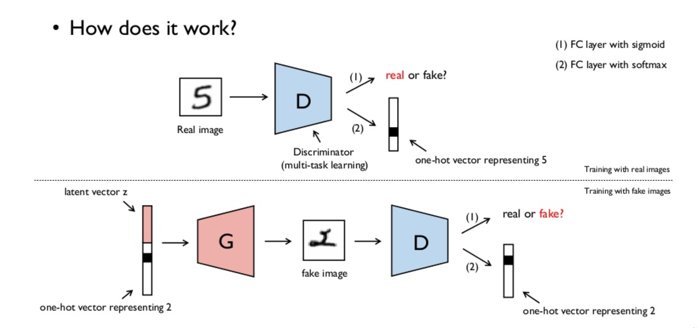

#  ACGAN in Keras

### Background
Auxiliary Classifier Generative Adversarial Networks (AC-GAN, [introduced by Odena, et al.](https://arxiv.org/abs/1610.09585), are an extension of the GAN framework. an AC-GAN makes the latent $z$ space conditional upon a class label, and forces the generator network to jointly learn to identify fake from non-fake images as well the task of correctly identifying the class of the image, fake or not. we have that the generator takes as input a latent vector and a class and produces an image in image-space, $\mathcal{I}$. 

$ g: (z, \ell) \longrightarrow M $

Where $z\in\mathbb{R}^D$, $M\in\mathcal{I}$, and $\ell\in\mathcal{L}$, the space of labels.

the discriminator performs the following mapping

$$
d: M \longrightarrow (f, h_{\ell})
$$

Where $M\in\mathcal{I}$, $f\in\{0, 1\}$ is whether or not $M$ is considered to be fake or not, and $h_{\ell}\in\mathcal{L}$ is the hypothesized label that was fed to $g$.

